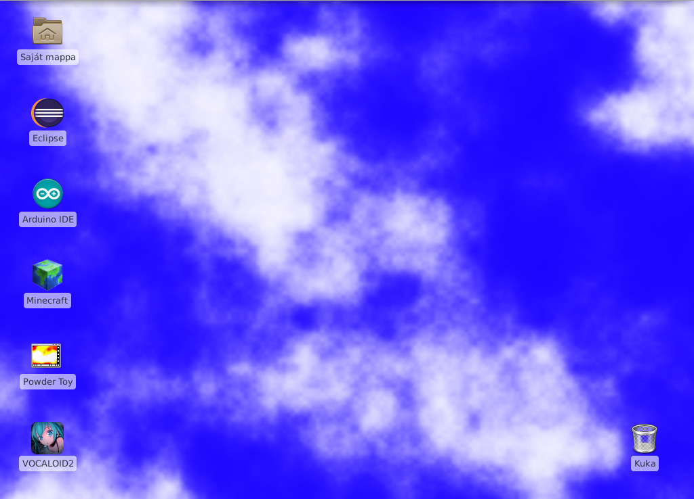
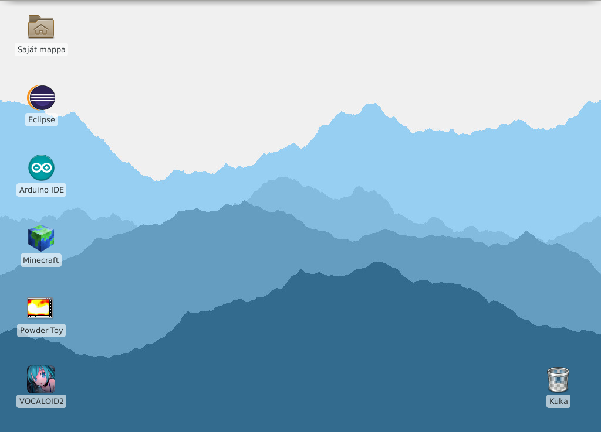
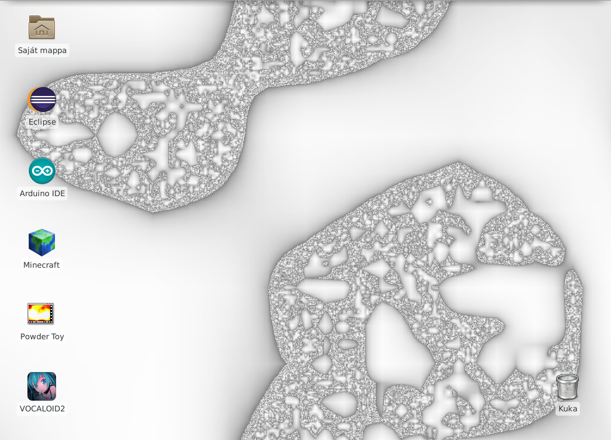
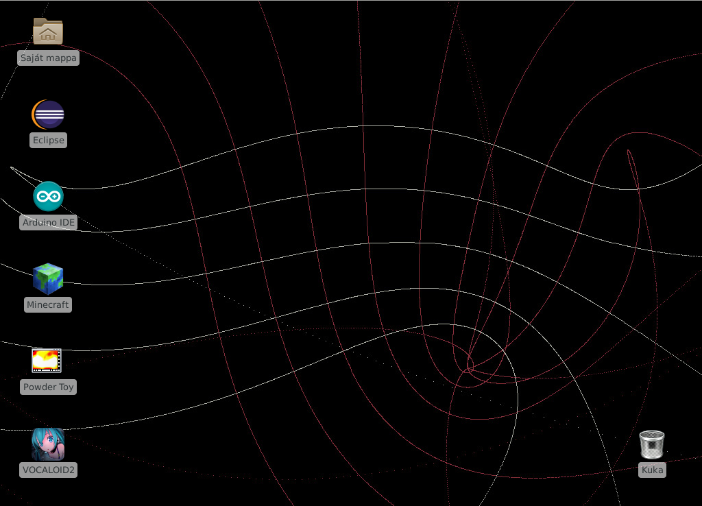
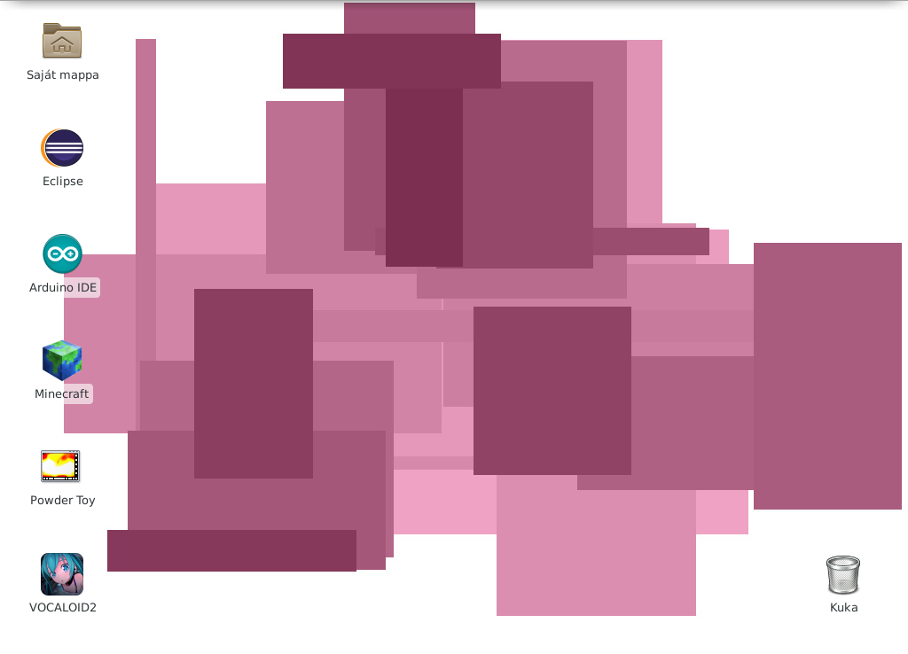

# procedural-wallpapers
A collection of wallpaper generators

## How to use (Linux only)
1. `sudo apt-get install gcc imagemagick`
1. `git clone https://github.com/ba-sz-at/procedural-wallpapers.git`
1. `cd procedural-wallpapers/src`
1. `./wp-gen`
1. The previous command should have generated a *wallpaper.jpg* in src. Set it as your desktop background.
1. Add the *wp-gen* script to your startup applications. This will change your wallpaper at each startup.

## Generators

<table>
<tr>
<td></td>
<td></td>
</tr>
<tr>
<td></td>
<td></td>
</tr>
<tr>
<td></td>
<td></td>
</tr>
</table>
## Notes
* All wallpapers are 1024x768. If you have a different resolution, you can either change your wallpaper style to Strech or rewrite the programs. Sorry.

## References && Acknowledgements
* The *clouds* and *islands* generators rely on the super-fast Perlin noise generator I found here: https://gist.github.com/nowl/828013
* The *landscape* generator is shamelessly stolen from here: https://tyrellrummage.github.io/landscape/
* The *marrowlike* generator follows the recursive algorithm described here: http://pcg.wikidot.com/forum/t-79282/multiplicative-cascades-ish