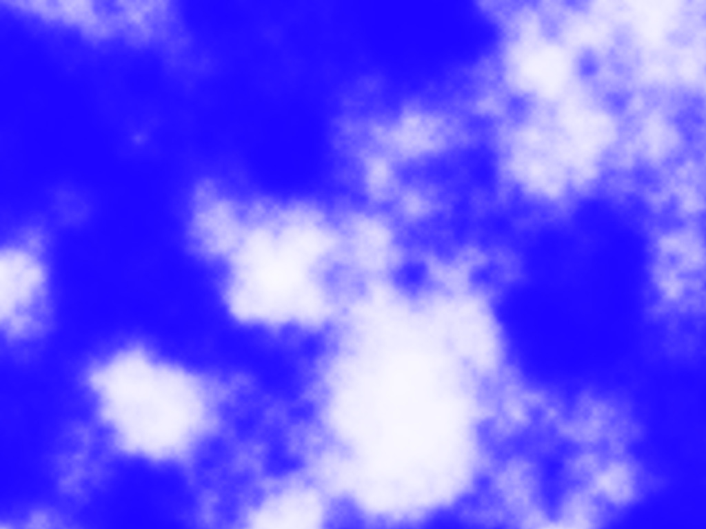
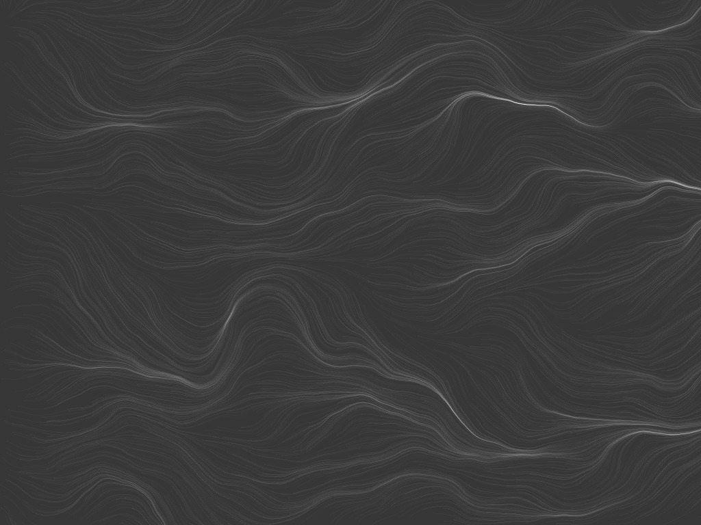
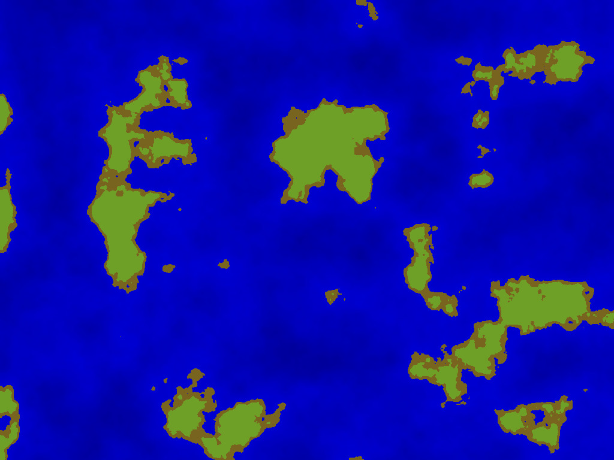
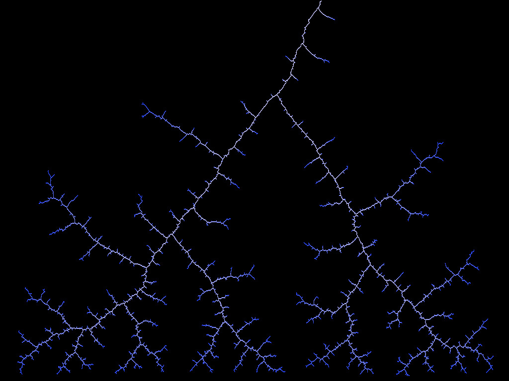
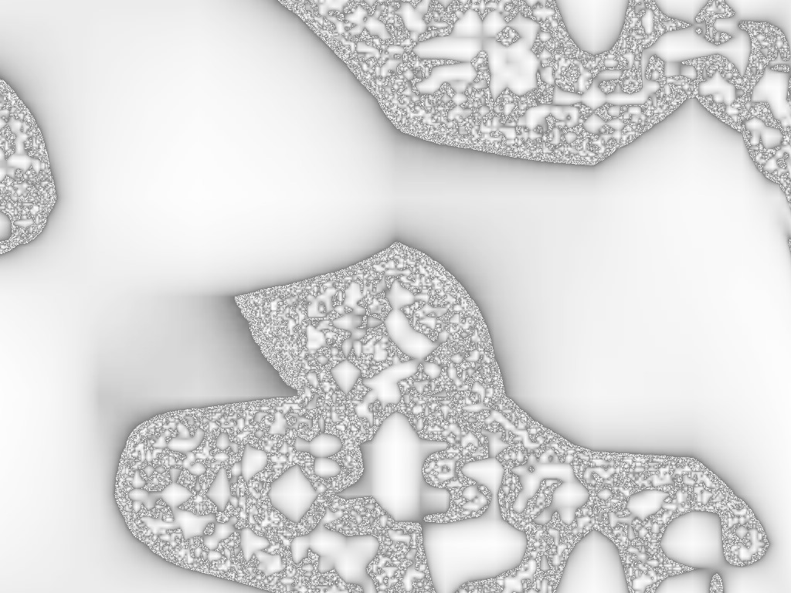
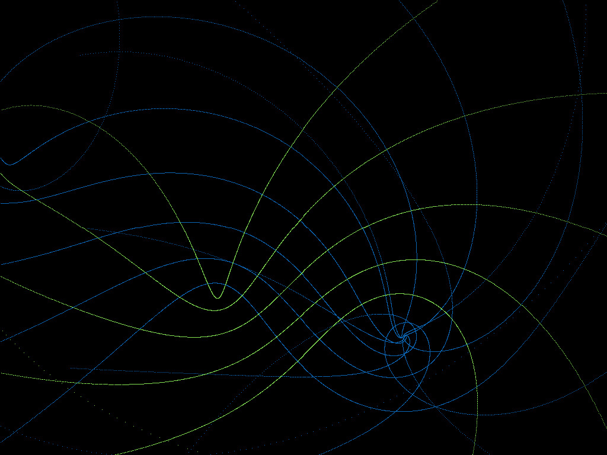
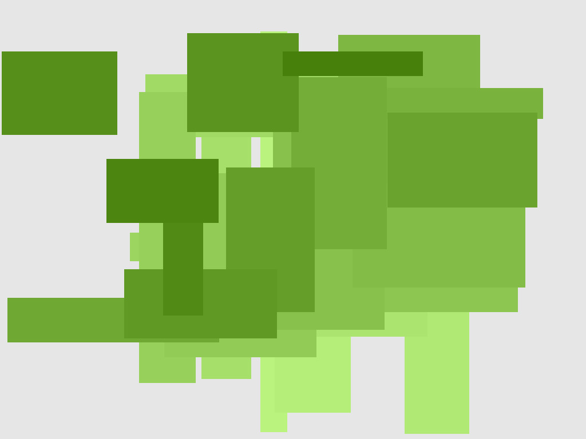
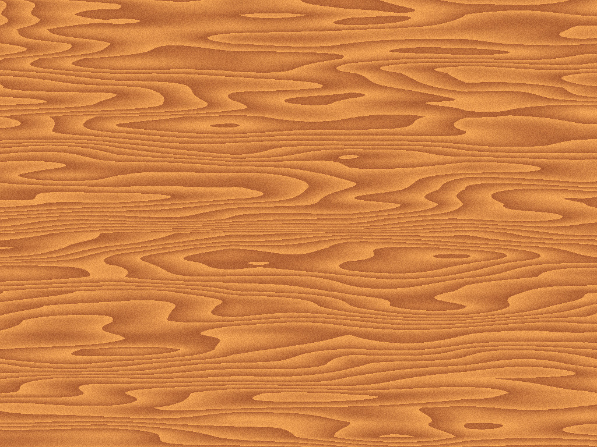

# procedural-wallpapers
A collection of wallpaper generators

## How to use (Linux only)
1. `sudo apt-get install gcc imagemagick`
1. `git clone https://github.com/ba-sz-at/procedural-wallpapers.git`
1. `cd procedural-wallpapers/src`
1. Open lib/main.h for editing.
1. Change WID and HEI to the width and height of your screen (pixels), and save.
1. `./wp-gen`
1. The previous command should have generated a *wallpaper.jpg* in src/out. Set it as your desktop background.
1. Add the *wp-gen* script to your startup applications. This will change your wallpaper at each startup.

## Generators

<table width="100%">
<tr>
	<td width="50%">
		
		<b>Clouds</b>
		
Perlin noise fed into a sigmoid function.
	</td>
	<td width="50%">
		
		<b>Fern</b>
		
Barnsley fern with mutation.
	</td>
</tr>
<tr>
	<td width="50%">
		
		<b>Flow</b>
		
Perlin flow field.
	</td>
	<td width="50%">
		
		<b>Islands</b>
		
Perlin noise fed into a cutoff function.
	</td>
</tr>
<tr>
	<td width="50%">
		
		<b>Landscape</b> (<a href="https://tyrellrummage.github.io/landscape/">original source</a>)
		
Simulated erosion using a midpoint displacement technique.
	</td>
	<td width="50%">
		
		<b>Lightning</b>
		
Similar to a Brownian tree but faster to generate.
	</td>
	
</tr>
<tr>
	<td width="50%">
		
		<b>Marrowlike</b> (<a href="http://pcg.wikidot.com/forum/t-79282/multiplicative-cascades-ish">original source</a>)
		
If a pixel is too dark, give it a random brightness. Scale to double size. Repeat.
	</td>
	<td width="50%">
		
		<b>Mesh</b>
		
Transformations of the complex plane.
	</td>
</tr>
<tr>
	<td width="50%">
		
		<b>Tangles</b>
		
Rec-tangles.
	</td>
	<td width="50%">
		
		<b>Water</b>
		
Very simple interference pattern generator.
	</td>
</tr>
<tr>
	<td width="50%">
		
		<b>Wood</b>
		
Modular Perlin noise stretched along the x axis.
	</td>
	<td width="50%">
		
		<b>Zebra</b>
		
The same complex function as in the Mesh program, but from a different perspective.
	</td>
</tr>
</table>

## Disclaimers
* The *landscape* generator is shamelessly stolen from here: https://tyrellrummage.github.io/landscape/
* The *marrowlike* generator follows the recursive algorithm described here: http://pcg.wikidot.com/forum/t-79282/multiplicative-cascades-ish
* The *fern* generator uses a fractal image compression method that might be patented (I couldn't find much information about it)

## Licensing
All programs, except for those listed in the Disclaimers section, are in the public domain.